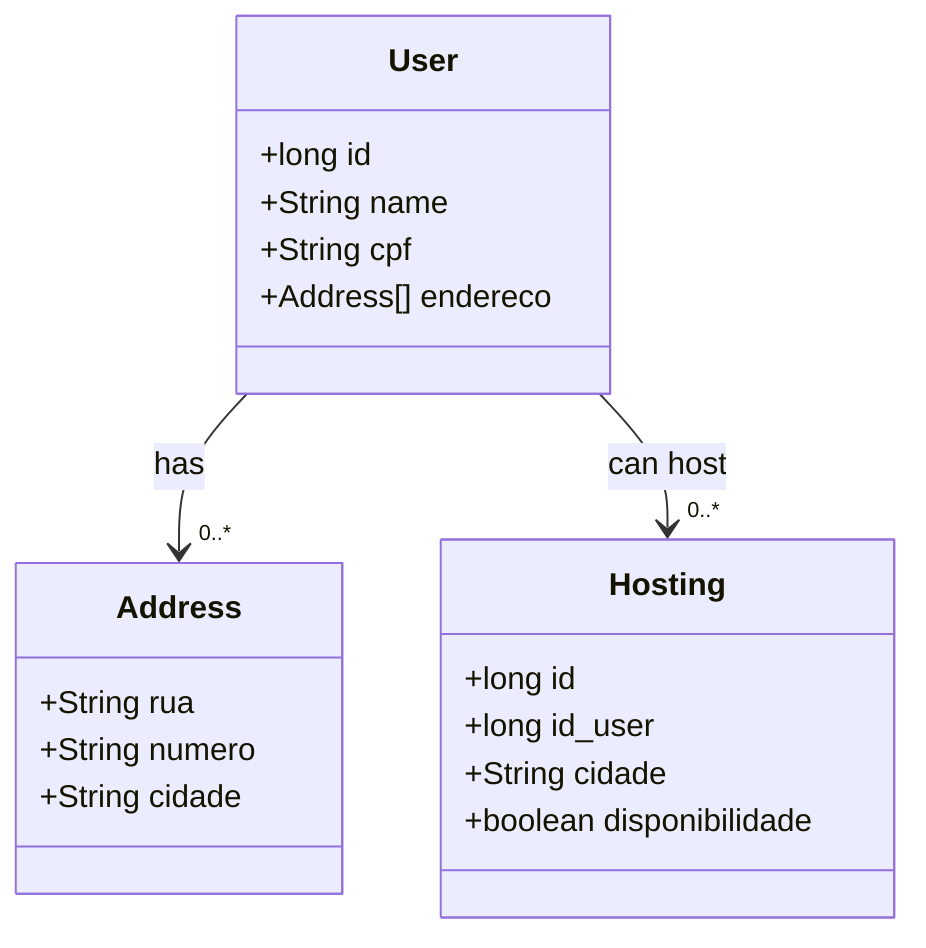

#Projeto de criação de uma API

```mermaid
classDiagram
    class User {
        +long id
        +String name
        +String cpf
        +Address[] endereco
    }

    class Address {
        +String rua
        +String numero
        +String cidade
    }

    class Hosting {
        +long id
        +long id_user
        +String cidade
        +boolean disponibilidade
    }

    User --> "0..*" Address : has
    User --> "0..*" Hosting : can host
```
