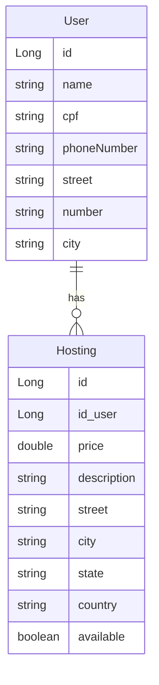

# 📚 API RESTful Hosting system com Spring Boot 🍃 + Docker 🐳

Bem-vindo! Este projeto é uma API RESTful desenvolvida para gerenciar usuários e hospedagens de forma eficiente, com suporte a containers Docker e banco de dados PostgreSQL. A seguir, você encontrará um guia sobre como utilizá-la.

## 📂 Sumário

- [⚒️ Tecnologias utilizadas]([#⚒️-Tecnologias-utilizadas-e-as-dependências-do-Java](https://github.com/brunopaz8/Hosting-system/edit/main/README.md#%EF%B8%8F-tecnologias-utilizadas-e-as-depend%C3%AAncias-do-java))
- [🗄️ Modelagem do Banco de Dados]([#💻-database-modeling](https://github.com/brunopaz8/Hosting-system/edit/main/README.md#%EF%B8%8F-database-modeling))
- [🚀 Como Executar o Projeto]([#🚀-como-executar-o-projeto](https://github.com/brunopaz8/Hosting-system/edit/main/README.md#-como-executar-o-projeto))
  - [🐳 Executando com Docker]([#🐳-executando-com-docker](https://github.com/brunopaz8/Hosting-system/edit/main/README.md#-executando-com-docker))
  - [💻 Execução Local (H2)]([#💻-execução-local-h2](https://github.com/brunopaz8/Hosting-system/edit/main/README.md#-modo-local---h2))
- [🗃️ Configuração do Banco de Dados H2]([#🗃️-configuração-do-banco-de-dados-h2](https://github.com/brunopaz8/Hosting-system/edit/main/README.md#%EF%B8%8F-configura%C3%A7%C3%A3o-do-banco-de-dados-h2))
- [📗 Documentação Swagger]([#📄-documentação-swagger](https://github.com/brunopaz8/Hosting-system/edit/main/README.md#-documenta%C3%A7%C3%A3o-swagger))
- [🔍 Requisições: User]([#🔍-requisições-user](https://github.com/brunopaz8/Hosting-system/edit/main/README.md#-fazendo-requisi%C3%A7%C3%B5es-user))
- [🔍 Requisições: Hosting]([#🔍-requisições-hosting](https://github.com/brunopaz8/Hosting-system/edit/main/README.md#-fazendo-requisi%C3%A7%C3%B5es-hosting))

---

### **⚒️ Tecnologias utilizadas e as dependências do Java**

- Java 17.0.4
- Maven 3.9.9
- Spring Boot (3.4.3)
  - **Spring Boot DevTools**
  - **Spring Web**
  - **Spring Data JPA**
  - **H2 Database**
  - **Spring Boot Actuator**
  - **Lombok Project**
  - **SpringDoc OpenAPI 2.x (para Swagger Ui)**
- Git/GitHub
- Docker & Docker Compose
---

### 🗄️ Database Modeling



---

## 🚀 Como Executar o Projeto

### 🐳 Executando com Docker
O projeto pode ser executado com **Docker** e utiliza o **PostgreSQL** como banco de dados persistente.

### 🔧 Pré-requisitos
- Docker
- Docker Compose

1️⃣ Clone o repositório:
```sh
git clone https://github.com/brunopaz8/Hosting-system
cd Hosting-system
```
2️⃣ No terminal, execute:
```sh
docker-compose up --build
```
3️⃣ (opcional) Parando o docker:
```sh
docker-compose down
```

---

## 💻 modo local - H2
1️⃣ Clone o repositório:
```sh
git clone https://github.com/brunopaz8/Hosting-system
cd Hosting-system
```

2️⃣ Instale as dependências e compile o projeto:
```sh
mvn clean install
```
3️⃣ Inicie o servidor:
```sh
mvn spring-boot:run
```
4️⃣ A API estará disponível em:
```
http://localhost:8080/
```
5️⃣ Caso queria usar o **swagger**, acesse:
```
http://localhost:8080/swagger-ui
```
---

## 🗃️ Configuração do Banco de Dados H2

- **URL JDBC:** `jdbc:h2:mem:testdb`
- **Driver:** `org.h2.Driver`
- **Usuário:** `sa`
- **Senha:** *(vazio)*
- **Dialect:** `org.hibernate.dialect.H2Dialect`

### Como acessar:

1. Acesse `http://localhost:8080/h2-console`
2. JDBC URL: `jdbc:h2:mem:testdb`
3. Usuário: `sa`
4. Clique em *Connect*

---

## 📗 Documentação Swagger
A API conta com documentação interativa via **Swagger UI**, facilitando testes e visualização dos endpoints.

### 🔗 Como Acessar a Documentação
Após iniciar a aplicação, acesse:

🔹 **Swagger UI:** [http://localhost:8080/swagger-ui](http://localhost:8080/swagger-ui)

📌 **Exemplo da interface Swagger UI:**


---

### 🔍 Fazendo Requisições (/User)

#### 🟣 Gerenciamento do User

| Method | Parameters | Action                              |
| ------ | ---------- | ----------------------------------- |
| POST   | /          | Cria um User                        |
| PUT    | /{id}      | Atualiza o User do id selecionado   |
| GET    | /          | Retorna uma lista de todos os Users |
| GET    | /{id}      | Retorna o User específico do id     |
| DELETE | /{id}      | Deleta o User do id selecionado     |

#### 🟣 Criando um User

- **Body (JSON):**
  ```json
  {
    "name": "nome",
    "cpf": "000.000.000-00",
    "street": "Rua Exemplo",
    "number": "00",
    "city": "cidade"
    "phoneNumber": "(00) 000000-000"
  }
  ```
---

### 🔍 Fazendo Requisições (/hosting)

#### 🟣 Gerenciamento do Hosting

| Method | Parameters | Action                                 |
| ------ | ---------- | -------------------------------------- |
| POST   | /          | Cria um Hosting                        |
| PUT    | /{id}      | Atualiza o Hosting do id selecionado   |
| GET    | /          | Retorna uma lista de todos os Hostings |
| GET    | /{id}      | Retorna o Hosting específico do id     |
| DELETE | /{id}      | Deleta o Hosting do id selecionado     |

#### 🟣 Criando um Hosting

- **Body (JSON):**
  ```json
  {
  "price": 0.0,
  "description": "descrição",
  "street": "rua",
  "city": "cidade",
  "state": "estado",
  "country": "pais",
  "available": true
  }
  ```
