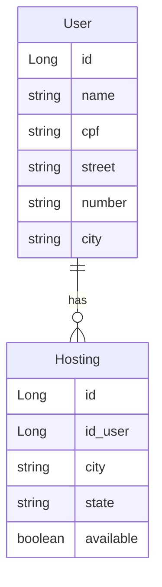

# 📚 API RESTful Hosting system com Spring Boot 🍃
Bem-vindo ao projeto! Esta API permite gerenciar usuários e hospedagens de maneira eficiente. Aqui está um guia para você começar a utilizá-la corretamente.

#### **🛠 Tecnologia usada e dependências do java**

- Java 17.0.4
- Maven 3.9.9
- Spring Boot (3.4.3)
  - **Spring Boot DevTools**
  - **Spring Web**
  - **Spring Data JPA** 
  - **H2 Database**
  - **Spring Boot Actuator**
  - **Lombok Project**
- Git/GitHub

#### 💻 H2 Database Modeling



### 🔍 Fazendo Requisições(/User)


Apos iniciar o projeto, o server vai ficar escutando da root http://localhost:8080/. 


#### 🔹 Gerenciamento do User

| Method | Parameters | Action                                                    |
| ------ | ---------- | --------------------------------------------------------- |
| POST   | /          | Cria um User                                              |
| PUT    | /{id}      | Autualiza o User do id selecionado                        |
| GET    | /          | Retorna uma lista de todos os User                        |
| GET    | /{id}      | Retorna o User específico do id                           |
| DELETE | /{id}      | Deleta o User do id secelionado                           |


#### 🔹 Criando um User
- **Body (JSON):**
  ```json
  {
    "name": "nome",
    "cpf": "123.456.789-00",
    "street": "Rua Exemplo",
    "number": "123",
    "city": "cidade"
  }
  ```


### 🔍 Fazendo Requisições(/hosting)


#### 🔹 Gerenciamento do Hosting

| Method | Parameters | Action                                                    |
| ------ | ---------- | --------------------------------------------------------- |
| POST   | /          | Cria um Hosting                                           |
| PUT    | /{id}      | Autualiza o Hosting do id selecionado                     |
| GET    | /          | Retorna uma lista de todos os Hosting                     |
| GET    | /{id}      | Retorna o Hosting específico do id                        |
| DELETE | /{id}      | Deleta o Hosting do id secelionado                        |


#### 🔹 Criando um Hosting
- **Body (JSON):**
  ```json
  {
    "id_user": ,
    "city": "shurima",
    "state": "RN",
    "available": false
  }
  ```

## 🚀 Como Executar o Projeto


## 📄 Licença
Este projeto está sob a licença MIT.

