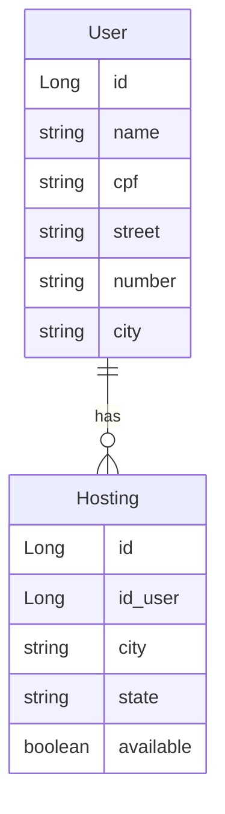

# 📚 API RESTful Hosting system com Spring Boot 🍃

Bem-vindo ao projeto! Esta API permite gerenciar usuários e hospedagens de maneira eficiente. Aqui está um guia para você começar a utilizá-la corretamente.

#### **🛠 Tecnologia usada e dependências do Java**

- Java 17.0.4
- Maven 3.9.9
- Spring Boot (3.4.3)
  - **Spring Boot DevTools**
  - **Spring Web**
  - **Spring Data JPA**
  - **H2 Database**
  - **Spring Boot Actuator**
  - **Lombok Project**
- Git/GitHub

#### 💻 H2 Database Modeling



### 🔍 Fazendo Requisições (/User)

Após iniciar o projeto, o servidor ficará escutando na root `http://localhost:8080/`.

#### 🟣 Gerenciamento do User

| Method | Parameters | Action                              |
| ------ | ---------- | ----------------------------------- |
| POST   | /          | Cria um User                        |
| PUT    | /{id}      | Atualiza o User do id selecionado   |
| GET    | /          | Retorna uma lista de todos os Users |
| GET    | /{id}      | Retorna o User específico do id     |
| DELETE | /{id}      | Deleta o User do id selecionado     |

#### 🟣 Criando um User

- **Body (JSON):**
  ```json
  {
    "name": "nome",
    "cpf": "123.456.789-00",
    "street": "Rua Exemplo",
    "number": "123",
    "city": "cidade"
  }
  ```

### 🔍 Fazendo Requisições (/hosting)

#### 🟣 Gerenciamento do Hosting

| Method | Parameters | Action                                 |
| ------ | ---------- | -------------------------------------- |
| POST   | /          | Cria um Hosting                        |
| PUT    | /{id}      | Atualiza o Hosting do id selecionado   |
| GET    | /          | Retorna uma lista de todos os Hostings |
| GET    | /{id}      | Retorna o Hosting específico do id     |
| DELETE | /{id}      | Deleta o Hosting do id selecionado     |

#### 🟣 Criando um Hosting

- **Body (JSON):**
  ```json
  {
    "id_user": 1,
    "city": "shurima",
    "state": "RN",
    "available": false
  }
  ```


## 🚀 Como Executar o Projeto

1. Clone o repositório: `git clone <https://github.com/brunopaz8/Hosting-system/tree/main>`
2. Instale as dependências
3. Execute o projeto
4. O servidor estará disponível em: `http://localhost:8080/`
5. O banco de dados H2 pode ser acessado via console em: `http://localhost:8080/h2-console`

### 💻 Configuração do Banco de Dados H2

- **URL JDBC:** `jdbc:h2:mem:testdb`
- **Driver:** `org.h2.Driver`
- **Usuário:** `sa`
- **Senha:** *(vazia)*
- **Dialect:** `org.hibernate.dialect.H2Dialect`
- **Modo Console:** Habilitado (`/h2-console`)

◼️Para acessar o banco via console H2:
1. Acesse `http://localhost:8080/h2-console`
2. No campo *JDBC URL*, insira `jdbc:h2:mem:testdb`
3. Usuário: `sa`, deixe o campo de senha em branco
4. Clique em *Connect* para visualizar as tabelas e dados


