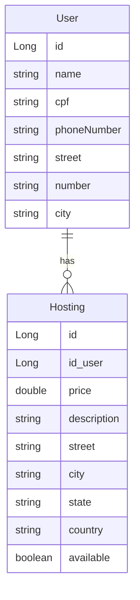

# 📚 API RESTful Hosting system com Spring Boot 🍃 + Docker 🐳

Bem-vindo! Este projeto é uma API RESTful desenvolvida para gerenciar usuários e hospedagens de forma eficiente, com suporte a containers Docker e banco de dados PostgreSQL. A seguir, você encontrará um guia sobre como utilizá-la.

---

## 📂 Sumário

- ⚒️ Tecnologias utilizadas
- 🔧 Funcionalidades
- 🗄️ Modelagem do Banco de Dados
- 🗃️ Configuração do Banco de Dados H2
- 🔍 Requisições:
   - **User**
   - **Hosting**
- 🚀 Como Executar o Projeto:
  - **🐳 Executando com Docker**
  - **💻 Execução Local (H2)**
  - **📗 Documentação Swagger**

---

## **⚒️ Tecnologias utilizadas e as dependências do Java**

- Java 17.0.4
- Maven 3.9.9
- Spring Boot (3.4.3)
  - **Spring Boot DevTools**
  - **Spring Web**
  - **Spring Data JPA**
  - **H2 Database**
  - **Spring Boot Actuator**
  - **Lombok Project**
  - **SpringDoc OpenAPI 2.x (para Swagger Ui)**
- Git/GitHub
- Docker & Docker Compose
  
---

## 🔧 Funcionalidades

- User
   - **Criar** um novo user
   - **Buscar** todos os users
   - **Bucar** por id
   - **Atualizar** um user existente
   - **Deletar** um user
- Host
   - **Criar** um novo host
   - **Buscar** todos os hosts
   - **Bucar** por id
   - **Atualiza**r um host existente
   - **Deletar** um host

---

## 🗄️ Database Modeling



---

## 🗃️ Configuração do Banco de Dados H2

- **URL JDBC:** `jdbc:h2:mem:testdb`
- **Driver:** `org.h2.Driver`
- **Usuário:** `sa`
- **Senha:** *(vazio)*
- **Dialect:** `org.hibernate.dialect.H2Dialect`

### Como acessar:

1. Acesse `http://localhost:8080/h2-console`
2. JDBC URL: `jdbc:h2:mem:testdb`
3. Usuário: `sa`
4. Clique em *Connect*

---

## 🔍 Fazendo Requisições (/User)

###  👤 Gerenciamento do User

| Method | Parameters | Action                                |
| ------ | ---------- | ------------------------------------- |
|🟢 POST   | /          | Cria um User                        |
|🟠 PUT    | /{id}      | Atualiza o User do id selecionado   |
|🔵 GET    | /          | Retorna uma lista de todos os Users |
|🔵 GET    | /{id}      | Retorna o User específico do id     |
|🔴 DELETE | /{id}      | Deleta o User do id selecionado     |

#### 🟢 Criando um User

- **Body (JSON):**
  ```json
  {
    "name": "nome",
    "cpf": "000.000.000-00",
    "street": "Rua Exemplo",
    "number": "00",
    "city": "cidade"
    "phoneNumber": "(00) 000000-000"
  }
  ```
  
---

## 🔍 Fazendo Requisições (/hosting)

### 🏨 Gerenciamento do Hosting

| Method | Parameters | Action                                   |  
| ------ | ---------- | ---------------------------------------- |
|🟢 POST   | /          | Cria um Hosting                        |
|🟠 PUT    | /{id}      | Atualiza o Hosting do id selecionado   |
|🔵 GET    | /          | Retorna uma lista de todos os Hostings |
|🔵 GET    | /{id}      | Retorna o Hosting específico do id     |
|🔴 DELETE | /{id}      | Deleta o Hosting do id selecionado     |

#### 🟢 Criando um Hosting

- **Body (JSON):**
  ```json
  {
  "price": 0.0,
  "description": "descrição",
  "street": "rua",
  "city": "cidade",
  "state": "estado",
  "country": "pais",
  "available": true
  }
  ```
  
---

## 🚀 Como Executar o Projeto:

### 🐳 Executando com Docker
O projeto pode ser executado com **Docker** e utiliza o **PostgreSQL** como banco de dados persistente.

#### 🔧 Pré-requisitos

- Docker
- Docker Compose
  
1️⃣ Clone o repositório:

```sh
git clone https://github.com/brunopaz8/Hosting-system
cd Hosting-system
```

2️⃣ No terminal, execute:

```sh
docker-compose up --build
```

3️⃣ (opcional) Parando o docker:

```sh
docker-compose down
```

---

### 💻 modo local - H2
1️⃣ Clone o repositório:

```sh
git clone https://github.com/brunopaz8/Hosting-system
cd Hosting-system
```

2️⃣ Instale as dependências e compile o projeto:

```sh
mvn clean install
```

3️⃣ Inicie o servidor:

```sh
mvn spring-boot:run
```

4️⃣ A API estará disponível em:

```
http://localhost:8080/
```

5️⃣ Caso queria usar o **swagger**, acesse:

```
http://localhost:8080/swagger-ui
```

---

### 📗 Documentação Swagger
A API conta com documentação interativa via **Swagger UI**, facilitando testes e visualização dos endpoints. Após iniciar a aplicação, acesse:

🟢 **Swagger UI:** [http://localhost:8080/swagger-ui](http://localhost:8080/swagger-ui)

📌 **Exemplo da interface Swagger UI:**

